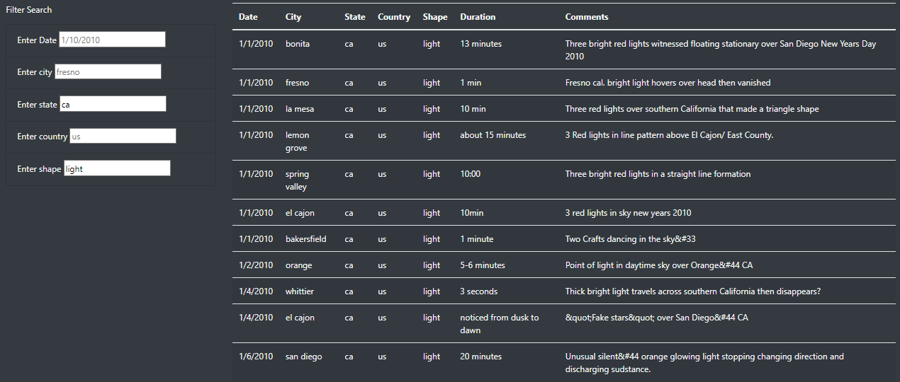

# UFO_sightings_web_filter

## Overview

This web filter for UFO sightings can filter for the Date, city, state, country, and a specified shape so all the UFO enthusiasts who want more searching criteria can find more intrigue. To create multiple filters we had to create multiple functions like updateFilters and filterTable to properly locate key/value pairs for displaying desired values.

## Results

-Search 1

-Search 2

One can enter as many search values as desired to narrow down the number of entries. If one has interest in UFO sightings in a specific city or state, simply enter the city or state.

## Summary

An easily noticeable drawback of this web filter is one can't easily discern the list of searching options for each filter. A list of available cities, states, shapes and so on would provide the user with a better idea of what is available for searching in the web filter. Recommendations for further developement would be to include more records for a larger dataset as well as a feature for displaying a sighting image for each record of interest.
